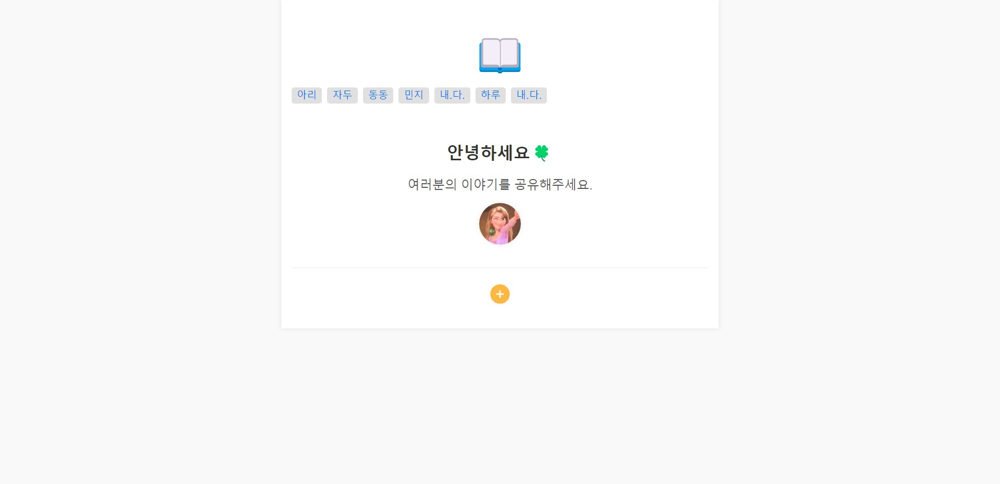

# 방명록

이 프로젝트는 Next.js를 기반으로 한 웹 애플리케이션으로, 
사용자가 웹 페이지에서 다양한 주제를 작성하고, 편집하며, 공유할 수 있는 기능을 제공합니다.

## 라이브 데모

프로젝트를 직접 확인하고 싶다면, 아래 링크를 통해 라이브 데모를 확인할 수 있습니다:



**[라이브 데모](https://nextapp-yougod.vercel.app/)**

## 소개

이 프로젝트는 Next.js와 React를 사용하여 웹 애플리케이션을 구축하였습니다. 
사용자는 게시물을 생성, 수정, 삭제할 수 있으며, 게시물의 내용을 풍부하게 표현할 수 있도록 
React Quill을 사용한 WYSIWYG 에디터가 포함되어 있습니다. 
또한 Tailwind CSS를 사용하여 반응형 디자인을 구현했습니다.

## 주요기능

- **게시물 작성**: 사용자가 Quill 에디터를 통해 새로운 게시물을 작성할 수 있습니다.
- **게시물 읽기**: 작성된 게시물을 읽을 수 있으며, HTML 형식으로 내용을 출력합니다.
- **게시물 수정**: 기존 게시물을 Quill 에디터를 통해 수정할 수 있습니다.
- **게시물 삭제**: 게시물을 삭제하는 기능이 포함되어 있습니다.

## 설치 방법

### 필수 조건

- Node.js (v14 이상) 및 npm이 설치되어 있어야 합니다.
- Next.js 및 관련 종속성 설치.

### 프로젝트 클론

먼저, 이 프로젝트를 클론합니다:
```bash
git clone <프로젝트 레포지토리 URL>
cd <프로젝트 디렉토리>
```

# 종속성 설치
프로젝트 디렉토리에서 필요한 종속성을 설치합니다:
```bash
npm install
```

# 환경 변수 설정
`.env.local` 파일을 생성하여 API URL 및 기타 필요한 환경 변수를 설정합니다.
```bash
NEXT_PUBLIC_API_URL=http://localhost:3000/api
```

# 개발 서버 실행
```bash
npm run dev
```

## 깃허브 통계 

<div align="center">
  
  
</div>

---
